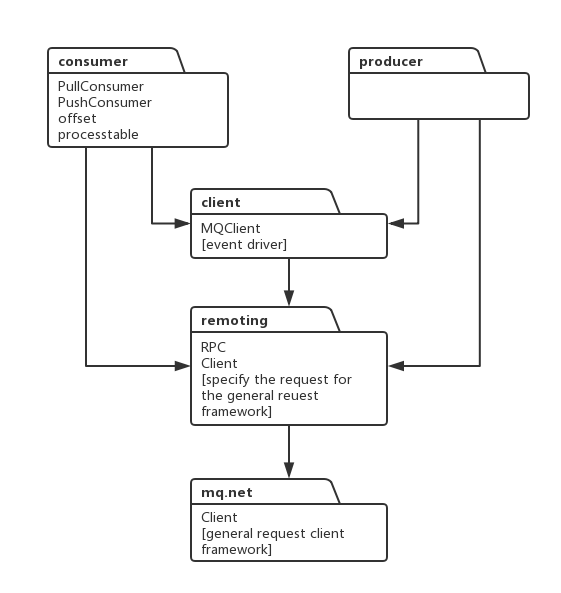

## package

### consumer

消费者。

基类`consumer`封装push、pull的消费模型的公共方法。

定时同步消费队列的变化。在Clustering消费模式下，叫负载均衡，在Broadcasting消费模式下，叫更新消费队列。

### producer

生产者。

### client

主要管理注册的producer、consumer。主要做3个事情：

1. 定时更新路由信息。
2. 定时向broker发送心跳，以及清除下线的broker结点信息。
3. 定时保存消费进度信息。

每个`clientID`对一个client实例。

### remote

通用的rpc框架。封装编解码，超时同步、异步、单向请求。
